# Top 27 Best Grammar Checker Tools in 2025

Nobody wakes up thinking "I can't wait to hunt down misplaced commas for three hours today," yet here we are in 2025, still wrestling with typos that slip past our tired eyes at 2 AM. Whether you're a content creator shipping blog posts daily, a student polishing that thesis, a business professional crafting client emails, or just someone who wants to stop embarrassing themselves in Slack messages, the right grammar checker makes the difference between confident communication and cringe-worthy mistakes.

The grammar checker landscape has evolved way beyond simple red squiggles. Modern tools use AI to catch contextual errors, suggest style improvements, check tone consistency, and even help you rewrite clunky sentences into something people actually want to read. Some specialize in creative writing with pacing analysis, others focus on academic precision, and a few just want to make your everyday emails less awkward.

## **[LanguageTool](https://languagetool.org)**

Free multilingual grammar checker supporting 30+ languages with powerful AI-driven corrections and privacy-focused architecture.

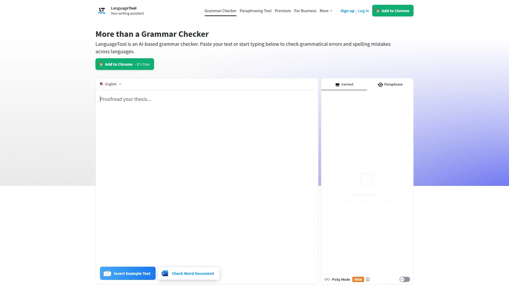

LanguageTool stands out by supporting over 30 languages and dialects, making it genuinely international in a market dominated by English-only tools. The free version handles spelling, basic punctuation, and simple style mistakes across all supported languages, while the Premium tier unlocks advanced grammar analysis, style suggestions, and the "Picky Mode" for catching subtle errors that other checkers miss.

The browser extensions work seamlessly across Chrome, Firefox, Edge, and Safari, integrating with Gmail, Google Docs, LinkedIn, and most web-based text fields without requiring copy-paste workflows. Desktop apps for Windows, Mac, and Linux extend checking to Microsoft Word, LibreOffice, and native applications. The distraction-free editor provides a clean writing environment with personal dictionary support, writing statistics, and secure cloud storage for your texts.

Privacy matters here—texts checked through browser extensions aren't stored, and the company emphasizes data protection. The paraphrasing tool uses AI to rephrase sentences for formality, fluency, simplicity, or conciseness. Premium plans add features like unlimited paraphrasing, genre-specific style checks, and team accounts for businesses. Organizations like BMW Group, the European Union, Spiegel Magazine, and JetBrains trust LanguageTool with their writing needs. For multilingual writers or teams working across language barriers, LanguageTool delivers functionality that monolingual competitors can't match.

## **[Grammarly](https://grammarly.com)**

Industry-leading grammar checker with AI-powered writing assistance, tone detection, and extensive integrations across platforms.

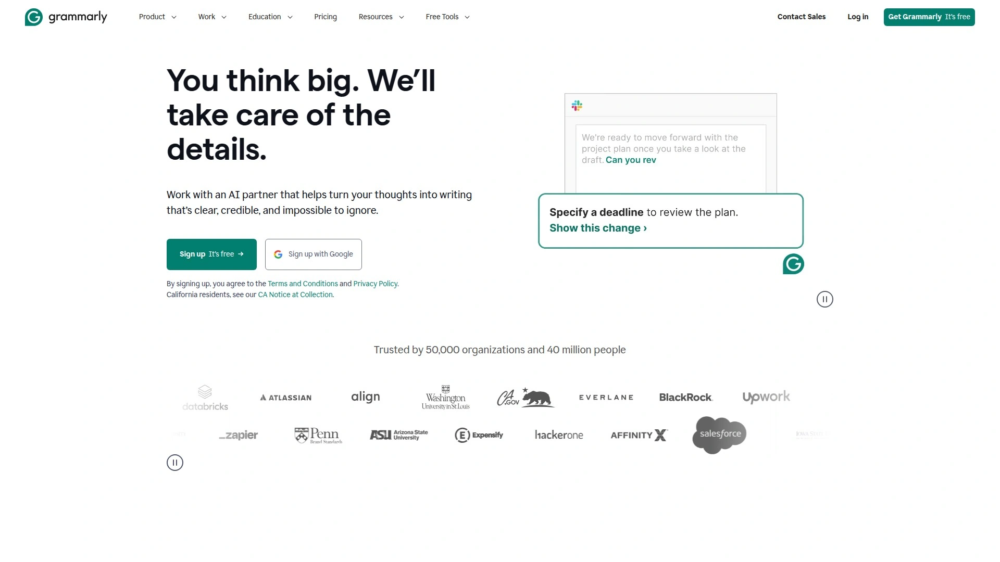

Grammarly built its reputation on accuracy and ease of use, delivering reliable grammar, spelling, and punctuation corrections with a polished interface. The free version catches essential errors and provides basic writing suggestions, making it useful for everyday writing without payment. Premium subscriptions add advanced features like clarity-focused sentence rewrites, tone adjustments, plagiarism detection, word choice optimization, and formality level controls.

The Chrome extension has over 3 million users, and the Firefox version tops 1 million, making it one of the most widely adopted writing tools. Integration covers Google Docs, Microsoft Word, Outlook, Gmail, LinkedIn, Twitter, Facebook, and essentially any web-based text field. Mobile apps for iOS and Android bring the same checking capabilities to smartphones and tablets.

The AI writing assistance goes beyond error correction to suggest complete sentence rewrites that improve readability and engagement. Tone detection analyzes your writing and indicates whether it sounds formal, casual, confident, or worried, helping you match the appropriate voice for your audience. Business and team plans add brand tone profiles, style guides, and analytics dashboards for organizations managing multiple writers. Monthly pricing starts at $30, with significant discounts for quarterly and annual commitments bringing it down to $12 per month. English-only support limits international users, and the free plan caps usage at 150,000 words per 30 days.

## **[ProWritingAid](https://prowritingaid.com)**

Comprehensive writing assistant built for authors and long-form content creators with deep manuscript analysis and style reports.

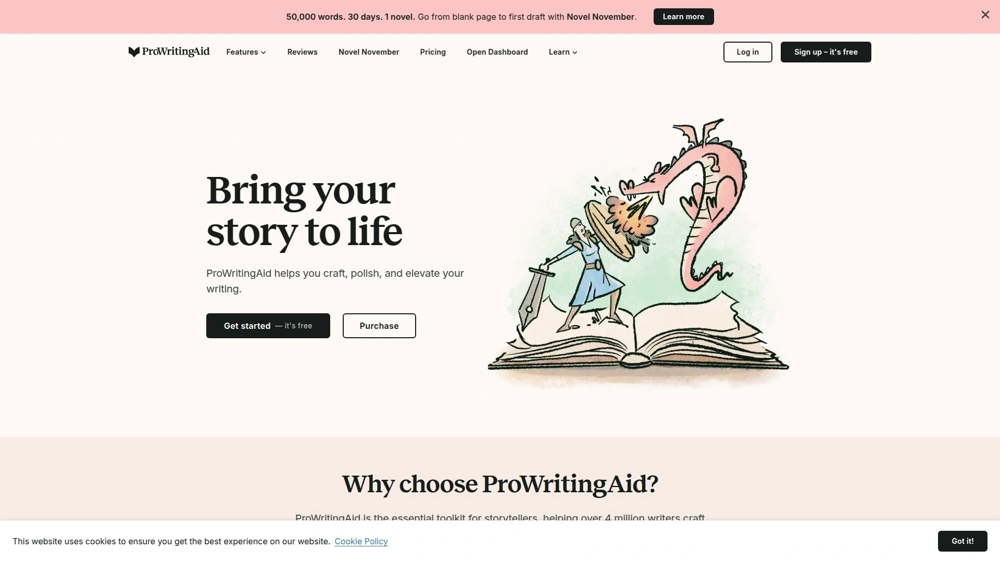

ProWritingAid targets creative writers, novelists, and anyone crafting long-form content with features that extend far beyond basic grammar checking. The platform provides 20+ detailed writing reports analyzing everything from grammar and spelling to pacing, sentence variety, repeated phrases, readability scores, sticky sentences, vague wording, and overused words. These reports help identify patterns in your writing that affect readability and engagement, something most grammar checkers ignore.

Integration with Scrivener—the preferred writing software for many novelists—gives it unique appeal for book authors. It also works with Microsoft Word, Google Docs, and web browsers. The free version checks up to 500 words at a time with grammar, spelling, and punctuation corrections, plus limited style suggestions. Premium plans unlock the full suite of reports, genre-specific suggestions that understand the differences between fantasy novels and business writing, and inclusive language checks.

Premium Pro adds AI-powered features including rephrasing suggestions, AI Sparks for creative prompts, context-specific rewrites, and 10,000 AI credits monthly. The lifetime plan option appeals to writers who prefer one-time payments over subscriptions, offering long-term value that subscription-only competitors can't match. While Grammarly catches more basic errors faster, ProWritingAid provides deeper analysis for writers serious about craft improvement. The tool requires more time to learn its features, but the payoff comes in genuinely improved writing skills over time.

## **[QuillBot](https://quillbot.com)**

AI paraphrasing specialist with grammar checking, multiple rewriting modes, and research tools for students and content creators.

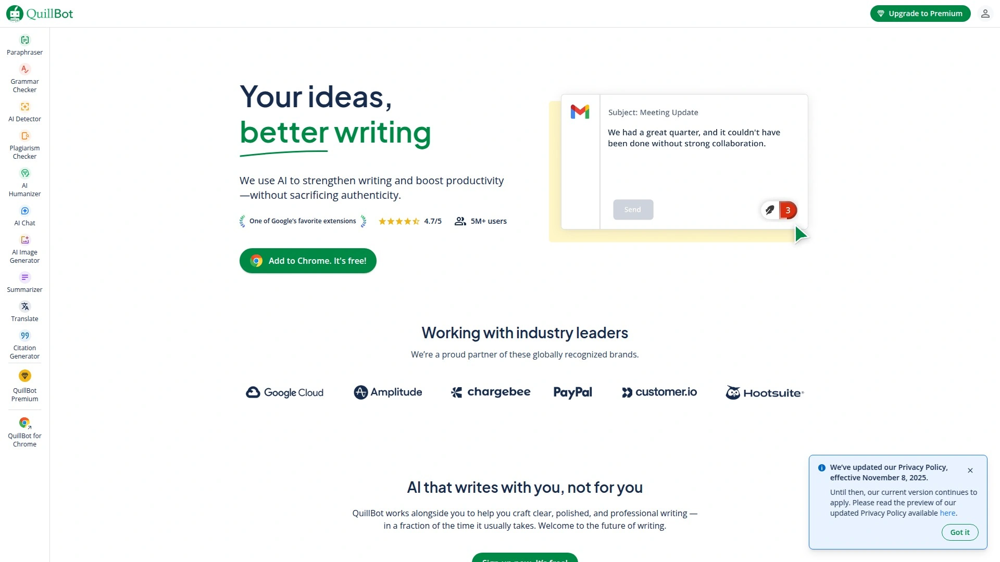

QuillBot earned top marks in independent testing, scoring 20 out of 20 corrections in comparison studies. The paraphrasing tool offers multiple modes including Standard, Fluency, Creative, and Formal, allowing you to transform text while preserving original meaning or shifting tone entirely. This makes it particularly valuable for students rewriting research, content creators avoiding repetitive phrasing, and anyone needing to express ideas differently.

The grammar checker identifies and corrects syntax, punctuation, and spelling errors with contextual awareness. Unlike simple spell checkers, it understands sentence structure and catches mistakes that depend on context. The summarizer condenses long articles or documents into key points, useful for research and content analysis. Citation generator helps students properly credit sources in various formats.

Integration works across web browsers without requiring signup, making it accessible for quick checks. The free version allows unlimited grammar checks, while premium plans expand paraphrasing capabilities and remove word limits. The interface uses a dual-pane layout showing original and revised text side-by-side, making changes easy to review and accept. For users focused on paraphrasing and rewriting rather than pure grammar correction, QuillBot delivers specialized capabilities that general-purpose checkers lack.

## **[Hemingway Editor](https://hemingwayapp.com)**

Readability-focused editor that identifies complex sentences, passive voice, and adverbs to make writing clear and direct.

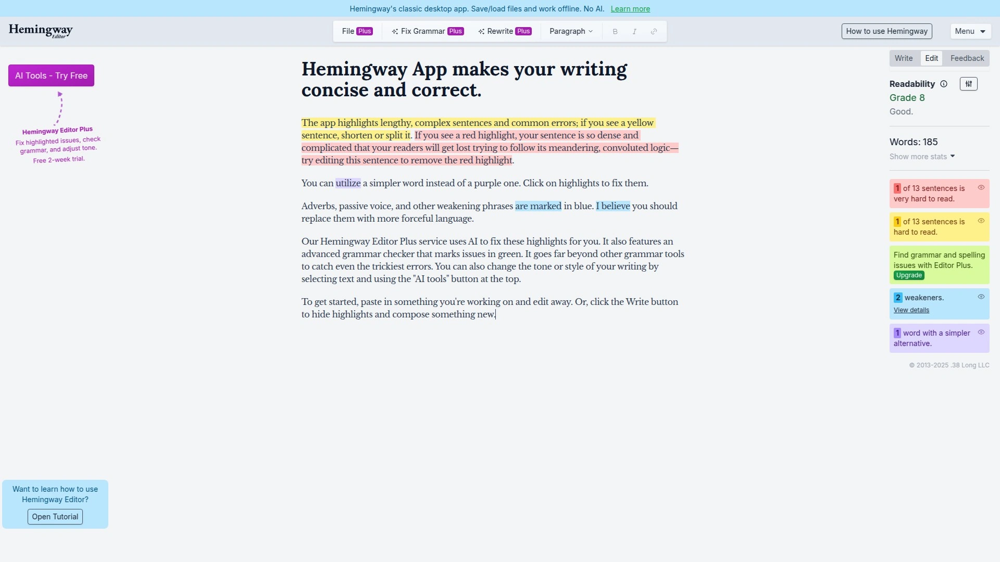

Hemingway Editor takes a different approach by prioritizing readability and clarity over pure grammar correction. Named after Ernest Hemingway's clear, concise writing style, it highlights sentences that are hard to read, flags excessive adverbs, points out passive voice usage, and suggests simpler alternatives for complex phrases. The tool assigns a grade level to your writing, showing exactly how accessible your content is to readers.

The free web version lets you paste or write text directly in the browser and see instant feedback with color-coded highlights. Hard-to-read sentences appear in yellow, very hard sentences in red, adverbs in blue, passive voice in green, and complex phrases in purple. This visual system makes problem areas immediately obvious. The desktop app costs $19.99 as a one-time purchase, working offline on Mac or Windows without internet requirements. The desktop version integrates with WordPress for one-click publishing and exports to Microsoft Word.

Hemingway doesn't catch all grammatical errors—it's not trying to. Instead, it focuses on making your writing more powerful by cutting unnecessary words and simplifying sentence structure. Writers who run their content through Hemingway consistently report stronger, more engaging final drafts. The tool works best after you've written your first draft and want to tighten the prose before publication. Some users note that it can flag good writing as problematic when complex sentences serve a purpose, so treat suggestions as guidance rather than rules.

## **[Wordtune](https://wordtune.com)**

AI rewriting assistant that offers contextual suggestions for rephrasing sentences with tone and style control.

Wordtune specializes in helping you say things better rather than just correctly. The AI analyzes your sentences and suggests alternative phrasings that improve clarity, adjust formality, or shift tone to match your intent. You can shorten wordy sentences, expand brief ones with more detail, or completely rewrite sections while maintaining your core message.

The real-time suggestions appear as you write, integrating seamlessly into your workflow across browsers and applications. Unlike grammar checkers that primarily flag errors, Wordtune proactively offers ways to enhance already-correct sentences, making them more engaging or professional. The tool includes options to make text more casual or formal, which helps when switching between contexts like internal team chats and client-facing emails.

Basic grammar checking handles spelling and punctuation errors, though it's less comprehensive than dedicated grammar checkers. The strength lies in stylistic enhancement and rewriting capabilities. You can even add jokes to content when appropriate, helping inject personality into otherwise dry material. The interface keeps formatting intact, supporting headings and structure better than tools requiring copy-paste workflows. Free accounts provide limited daily rewrites, while premium plans unlock unlimited transformations and additional features. For users who know grammar basics but struggle with phrasing and tone, Wordtune fills a gap that pure grammar checkers miss.

## **[Ginger](https://gingersoftware.com)**

Grammar checker with sentence rephrasing, translation features, and personal trainer approach to improve writing skills over time.

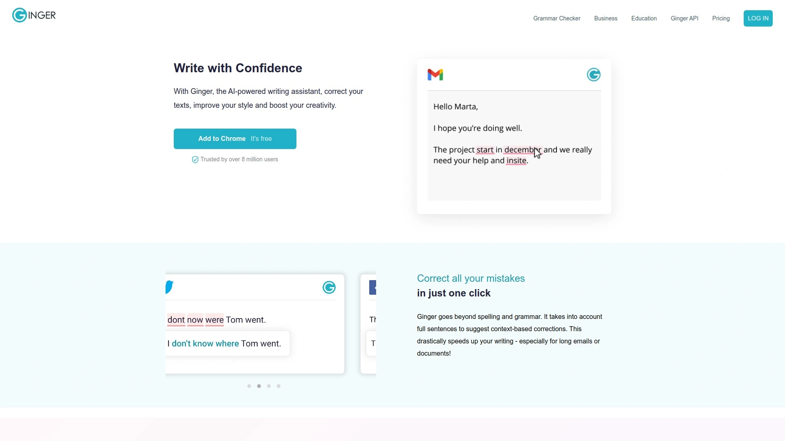

Ginger corrects grammar, spelling, and punctuation mistakes while providing explanations that help you understand why errors occurred. This educational approach turns error correction into learning opportunities, gradually improving your writing skills rather than just fixing immediate problems. The sentence rephraser suggests alternative ways to express ideas, adding versatility beyond basic checking.

Translation capabilities support over 40 languages, making it useful for multilingual writers or those reading foreign content. While not as sophisticated as dedicated translation software, it handles basic translation needs without switching tools. The personal dictionary learns words specific to your industry or subject area, reducing false positives over time.

Integration covers Microsoft Word, Outlook, browsers, and mobile devices. The desktop application works offline once installed, useful when internet access is unreliable. Free and premium tiers are available, with premium removing word limits and unlocking advanced features. One limitation—Ginger requires internet connectivity for most checking operations, so it won't work completely offline like some alternatives. The interface looks somewhat dated compared to modern competitors, but functionality remains solid. For users wanting grammar help that teaches rather than just corrects, Ginger's approach has merit.

## **[WhiteSmoke](https://whitesmoke.com)**

Comprehensive writing suite covering grammar, style, punctuation, and translation with detailed rule explanations.

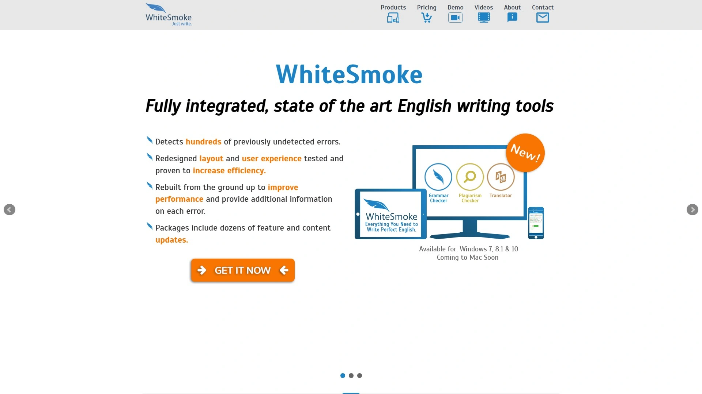

WhiteSmoke has been around for years, staying relevant through continuous updates to its core technology. The platform checks grammar, style, spelling, and punctuation across various writing types, from academic papers to business documents. What distinguishes it is the depth of explanations provided for flagged errors—when it identifies a mistake, it doesn't just suggest a fix but explains the grammar rule involved with examples showing correct usage.

This educational component helps writers understand the underlying principles, making them better at avoiding similar mistakes in future writing. The translation feature is more robust than most grammar checkers, supporting over 50 languages with reasonable accuracy for understanding foreign text or creating basic translations.

Three versions are available: web-based platform accessible from any browser, desktop application integrating with word processors, and mobile version for smartphones. The desktop version works directly with Microsoft Word and Outlook, catching errors as you type in those applications. Unlike some competitors, WhiteSmoke doesn't offer a free version—all plans require payment. Pricing is generally more affordable than Grammarly's premium tiers, and lifetime deals appear periodically offering one-time payment options. For users wanting comprehensive checking with strong explanations and translation capabilities, WhiteSmoke delivers solid value despite lacking the polish of newer competitors.

## **[Writer.com](https://writer.com)**

Enterprise-focused AI writing platform with brand voice controls, style guides, and team collaboration features.

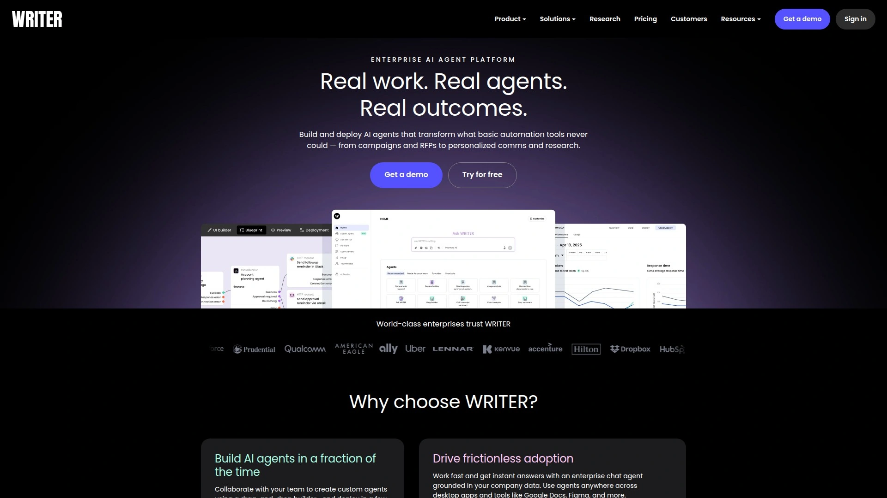

Writer targets businesses and organizations needing consistent writing across teams. The platform includes grammar and style checking, but extends into brand management with customizable style guides, terminology databases, and tone controls ensuring everyone writes in the company's voice. This matters for organizations where multiple people create customer-facing content and consistency affects brand perception.

AI writing assistance helps generate and refine content while maintaining brand standards. Team features enable collaborative editing, approval workflows, and usage analytics showing how effectively guidelines are being followed. Integration with business tools like Figma, Chrome, Word, and Google Docs brings checking capabilities into existing workflows without forcing platform switches.

The focus on enterprise means features like single sign-on, admin controls, and security compliance that individual users don't need but organizations require. Pricing reflects the enterprise positioning, making it less practical for solo users or small teams with limited budgets. Free plans are restrictive compared to consumer-focused alternatives. For marketing teams, content departments, and businesses where brand voice matters more than individual writing preferences, Writer provides centralized control that tools like Grammarly and ProWritingAid don't offer.

## **[Linguix](https://linguix.com)**

Browser-based grammar checker with content quality scoring, rewriting suggestions, and shortcuts for repetitive text.

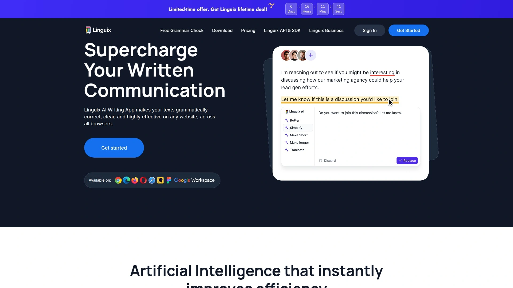

Linguix delivers grammar, spelling, and style checking through browser extensions working across websites and applications. The platform catches contextual errors that simple spell checkers miss, using AI to understand sentence structure and meaning. Content quality scoring provides an overall assessment of your writing, helping you gauge readability and professionalism before hitting send.

Text shortcuts and templates speed up repetitive writing tasks—create short codes that expand into full phrases, signatures, or commonly used paragraphs. This feature particularly helps customer service teams, sales professionals, and anyone who types similar content repeatedly. The rewriting suggestions help transform clunky sentences into clearer alternatives without manual editing.

The free version covers basic grammar and spelling corrections with limited features. Premium plans unlock advanced style suggestions, full content quality reports, team features, and unlimited rewrites. Mobile apps extend checking to smartphones and tablets. The interface emphasizes speed—checks happen in real-time as you type, with minimal lag even on longer documents. While less feature-rich than ProWritingAid or Grammarly Premium, Linguix offers a streamlined experience focused on core grammar checking and productivity enhancement for users who don't need exhaustive writing reports.

## **[Trinka](https://trinka.ai)**

Academic and technical writing specialist with discipline-specific suggestions and LaTeX document support.

Trinka focuses specifically on academic, technical, and formal writing rather than general content. The AI provides corrections and suggestions tailored to scientific, medical, business, and arts writing, understanding the conventions and terminology specific to each field. This specialization makes it more accurate for research papers, journal articles, dissertations, and technical reports than general-purpose checkers.

Support for LaTeX documents sets it apart—you can check LaTeX files directly without affecting TeX code, essential for researchers and academics using LaTeX for papers. The system identifies inconsistencies in spelling, hyphenation, dashes, accented characters, and formatting to ensure professional appearance. Each suggestion includes explanations helping you understand the reasoning and learn from corrections.

Proofreading integrates with Microsoft Word, retaining original formatting while adding corrections and providing a language quality score. The paraphrasing tool rewrites sentences while preserving technical meaning, useful when journal reviewers request clarification. Plagiarism checking scans against major publisher databases, catching unintentional duplication in academic work. Support covers both English and Spanish texts.

Privacy protection ensures your research stays confidential—data remains under your control rather than being used for model training. Free access includes basic grammar checking, while premium plans add advanced features and higher usage limits. For students, researchers, and technical professionals writing in specialized domains, Trinka understands conventions that general tools miss.

## **[PaperRater](https://paperrater.com)**

Free automated proofreader with plagiarism detection, automated grading, and writing instruction for students.

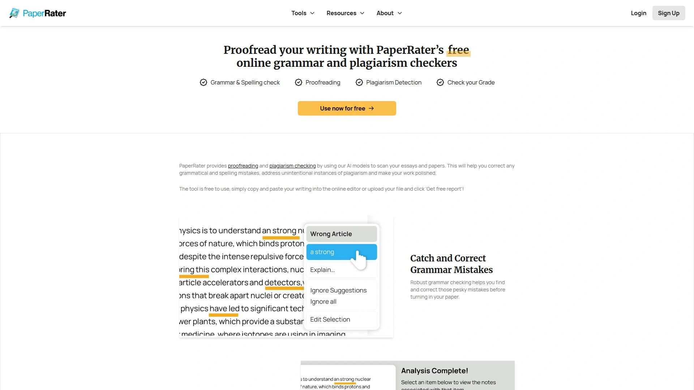

PaperRater targets students and educators with features specifically designed for academic writing. The automated proofreader checks grammar, spelling, punctuation, and style using cloud-based machine learning that identifies errors contextually rather than through simple pattern matching. Plagiarism detection scans submitted text against online sources, helping students ensure originality before submission.

The automated grading feature provides a score reflecting what you might receive from a teacher, giving you a rough assessment before turning in assignments. This helps gauge whether your paper meets expectations. Writing instruction modules analyze vocabulary usage, sentence length and variety, passive voice frequency, readability statistics, and sentence beginning patterns, providing feedback that improves writing skills over time.

Results appear in seconds rather than minutes, running 24/7 without requiring signup or login. This removes barriers making it accessible for quick checks. The vocabulary builder tool teaches new words with definitions and usage examples. Free access covers the core feature set, while premium plans add deeper analysis and remove limits. The interface looks dated compared to modern competitors, and customer support receives mixed reviews. For students working on essays, term papers, and academic assignments without budget for paid tools, PaperRater delivers functional checking at no cost.

## **[Scribens](https://scribens.com)**

Free grammar checker with browser extensions and office integrations, supporting 30+ languages without signup requirements.

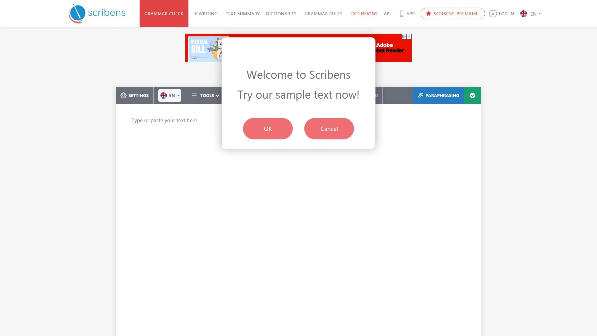

Scribens checks grammar, spelling, conjugation, agreement errors, punctuation, typography, and common mistakes across a wide range of error types. The AI-powered algorithm detects subtle errors in context, going beyond simple dictionary lookups to understand sentence structure and meaning. Independent testing shows it corrects over 90% of grammar and spelling mistakes.

Integration covers Gmail, Outlook, Yahoo, Facebook, Twitter, LinkedIn, Instagram, Messenger, forums, blogs, and most websites through browser extensions. You can also use it directly with Microsoft Word, PowerPoint, Excel, Google Docs, and Google Sheets without copy-pasting, maintaining original formatting throughout the checking process. Support extends to over 30 languages, making it genuinely multilingual.

The service is completely free with no paid tiers or upsells. Security includes SSL encryption for data transfer and Cloudflare protection against attacks. No text is stored on servers, protecting privacy. The interface is straightforward—paste your text and receive immediate feedback with corrections highlighted. While it lacks advanced features like style analysis, tone detection, or paraphrasing found in premium tools, Scribens delivers reliable basic checking without cost or signup friction. For users needing quick grammar checks across multiple languages without creating accounts or paying subscriptions, Scribens removes all barriers to access.

## **[Sapling](https://sapling.ai)**

AI writing assistant optimized for customer-facing teams with autocomplete suggestions and quality improvement features.

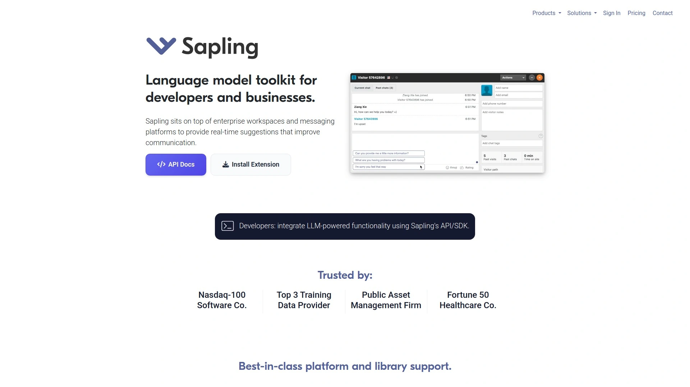

Sapling targets customer service, sales, and support teams writing repetitive responses. The autocomplete feature predicts what you're typing and suggests completions based on common phrases and your team's response patterns, speeding up reply times. Quality checking ensures responses maintain professional standards before reaching customers.

Grammar and spelling corrections happen in real-time across web applications and messaging platforms. Team features enable shared snippets, response templates, and analytics showing response time and quality metrics. Integration covers help desk software, CRMs, and communication platforms commonly used by customer-facing teams.

The platform learns from your team's writing patterns, making suggestions increasingly relevant over time. Managers gain visibility into team writing quality and efficiency. While it includes grammar checking, the primary value comes from productivity features designed for high-volume response scenarios. Pricing reflects the team-oriented approach, making it less suitable for individual users or writers outside customer service contexts. For support teams and sales organizations where response speed and consistency matter, Sapling delivers specialized capabilities that general grammar checkers don't address.

## **[Outwrite](https://outwrite.com)**

Chrome-based grammar checker with paraphrasing capabilities, readability metrics, and multi-language support.

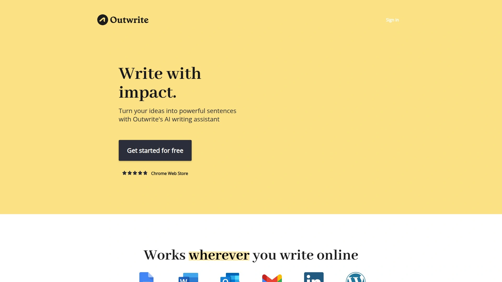

Outwrite rebranded from GradeProof in 2020, evolving into a comprehensive writing assistant working across Gmail, Outlook, LinkedIn, Medium, and WordPress. The free version includes spell checking, grammar and punctuation correction, thesaurus suggestions, and writing statistics including readability, grade level, and word count. Support covers English, French, and Spanish.

The Pro plan adds paraphrasing to rewrite and restructure entire sentences, style suggestions, structure recommendations like converting passive voice to active, and plagiarism checking. The paraphrasing tool helps when you know what you want to say but struggle with phrasing. Over 1 million people use Outwrite for tasks ranging from editing homework and enhancing college assignments to writing website copy and refining business documents.

Integration extends beyond Chrome to Google Docs, Microsoft Word, Edge, iOS, and a web app, providing consistent checking across devices. The interface emphasizes clarity—clean canvas for writing with optional recommendations panel showing real-time feedback. Availability across platforms ensures you can check writing wherever you work. For users wanting capable grammar checking with paraphrasing features at reasonable cost, Outwrite balances functionality and affordability.

## **[Jasper](https://jasper.ai)**

AI content generation platform with grammar checking, multiple writing templates, and brand voice customization for marketing teams.

Jasper extends beyond grammar checking into full AI content generation, targeting marketers and content creators. The platform includes 40+ templates for various content types, Boss Mode for long-form writing with AI assistance, and Jasper Chat functioning like ChatGPT for research and ideation. The AI image generator creates custom visuals based on prompts.

Grammar checking ensures generated and edited content maintains correctness, but the real power lies in content creation capabilities. You can write commands directly in the document like "expand this section about customer benefits" and Jasper generates relevant content using context from surrounding text. The Google Docs-style editor feels natural for anyone used to standard word processors.

Integration with Surfer SEO helps optimize content for search engines while writing. The platform supports multiple natural language processing models, providing flexibility in output style. Pricing reflects the advanced feature set, starting higher than pure grammar checkers but delivering substantially more capability. For content teams producing blog posts, articles, marketing copy, and social media content at scale, Jasper speeds up the writing process by 2-5x while maintaining quality. If you only need grammar checking, simpler tools suffice, but for AI-assisted content creation with built-in grammar checking, Jasper delivers comprehensive functionality.

## **[Copy.ai](https://copy.ai)**

Template-driven AI writing tool with over 90 specialized templates for short-form marketing copy and content generation.

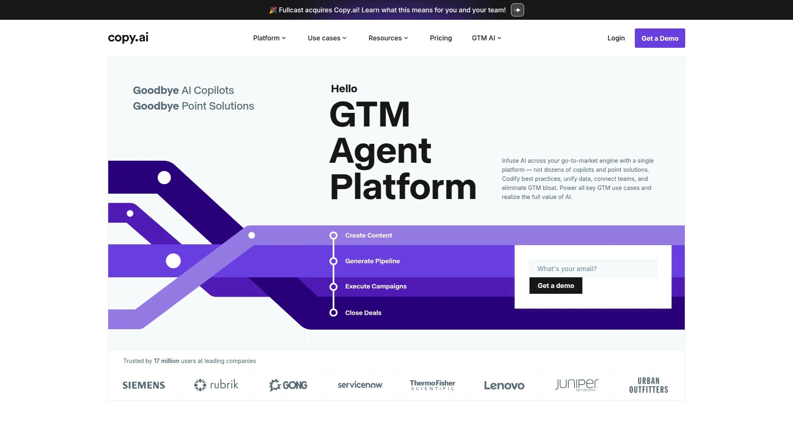

Copy.ai focuses on generating specific types of marketing copy through an extensive template library. Need Facebook ad headlines, product descriptions, email subject lines, or landing page copy? There are dedicated templates for each, streamlining creation of repetitive marketing content. The Blog Post Wizard walks through title, outline, and draft creation step-by-step.

Grammar checking ensures output maintains correctness, though the primary value lies in generation rather than editing. The template-driven approach makes Copy.ai efficient for teams producing similar content types repeatedly—you're not starting from blank pages but filling in prompts that guide the AI toward desired results.

Free plans allow limited monthly generation, while paid plans unlock unlimited content creation. The interface prioritizes speed over customization, getting usable copy quickly rather than offering deep editing capabilities. Integration options connect generated content to blogging platforms and marketing tools. For marketers, e-commerce teams, and content creators focused on short-form copy who need quick generation with basic grammar checking, Copy.ai delivers practical efficiency. Writers needing deep grammar analysis or long-form capabilities should look at alternatives, but for cranking out marketing copy at scale, the template approach works.

## **[Rytr](https://rytr.me)**

Affordable AI writing assistant with 40+ use cases, tone customization, and built-in plagiarism checking at budget-friendly pricing.

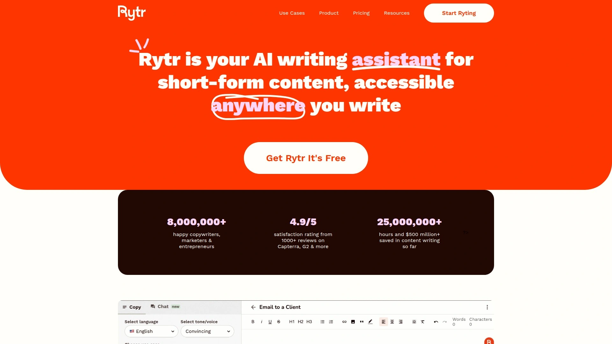

Rytr delivers AI content generation and grammar checking at remarkably low prices—the unlimited plan costs just $7.50 monthly. Over 40 content use cases cover everything from email responses and blog posts to social media ads and product descriptions. The AI can finish sentences, continue writing automatically, expand or shorten content, check grammar, and generate paragraphs contextually relevant to existing text.

The tone customization feature analyzes your writing sample and mirrors your voice in generated content. You can create multiple custom tones for different scenarios, projects, or clients, maintaining consistency across various writing contexts. Built-in plagiarism checking ensures originality, important when generating content from AI prompts that might inadvertently reproduce training data.

The Chrome extension brings Rytr's capabilities to wherever you write on the web. Free accounts include 10,000 characters monthly with access to 40+ use cases and 20+ tones, letting you test thoroughly before committing to paid plans. The interface emphasizes simplicity over complexity, getting you to usable content quickly. Grammar checking happens automatically during generation and editing, maintaining correctness without separate checking passes. For individuals and small businesses wanting AI writing assistance with grammar checking on a tight budget, Rytr delivers surprising value at its price point.

## **[Writesonic](https://writesonic.com)**

AI content platform generating 1500-word articles in seconds with SEO optimization, Semrush integration, and grammar checking.

Writesonic specializes in speed, generating blog posts up to 1,500 words in roughly 15 seconds. The platform includes 100+ templates for articles, ads, social media, product descriptions, and more. Grammar and plagiarism checking ensure output maintains quality and originality.

The Google Docs-like editor supports long-form content creation with AI assistance for improving and refining existing writing. Integration with Semrush enables keyword research and SEO optimization during the writing process, helping content rank better in search results. The landing page generator creates complete pages exportable as code for quick publishing.

Voice commands let you dictate content, and the expander/shortener features adjust length while maintaining meaning. Support covers approximately 25 languages, extending usefulness beyond English-only markets. Integration with WordPress, Wix, and Medium allows direct publishing without copy-paste workflows. Pricing aims lower than competitors like Jasper while delivering comparable generation quality, positioning it as a cost-effective alternative for SEO-focused content creation. For bloggers and content marketers needing fast article generation with built-in grammar checking and SEO features, Writesonic balances speed, quality, and affordability.

## **[Anyword](https://anyword.com)**

AI copywriting tool with predictive performance scoring and conversion-focused suggestions for marketing content.

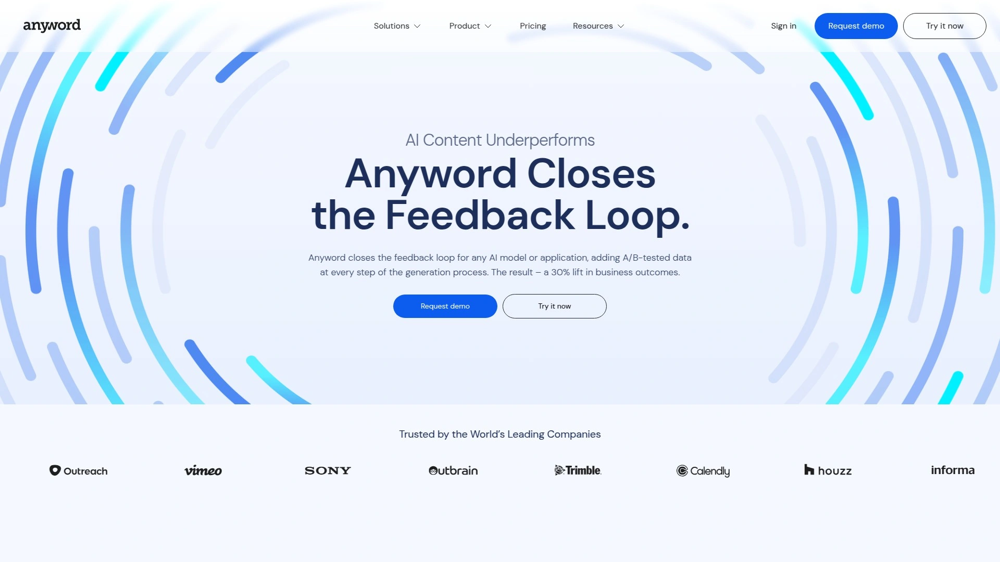

Anyword differentiates by predicting which copy variations will perform better before you publish. The platform analyzes content and provides performance scores based on conversion potential, helping marketers choose phrasing likely to drive results. This data-driven approach suits marketing teams where measurable outcomes matter more than stylistic preferences.

Grammar checking ensures technical correctness while the AI suggests copy variations optimized for engagement and conversion. Templates cover ads, landing pages, emails, and social media posts. The focus stays firmly on marketing and sales copy rather than long-form content or creative writing.

Integration options connect to marketing platforms and analytics tools. The performance prediction feature requires substantial data to train effectively, making it more valuable for established brands running multiple campaigns than new users with limited history. Pricing reflects the advanced analytics capabilities. For marketing teams treating copy as a conversion optimization challenge rather than pure creative expression, Anyword's predictive approach offers unique value.

## **[Slick Write](https://slickwrite.com)**

Free browser-based grammar checker emphasizing stylistic analysis with customizable feedback and detailed statistics.

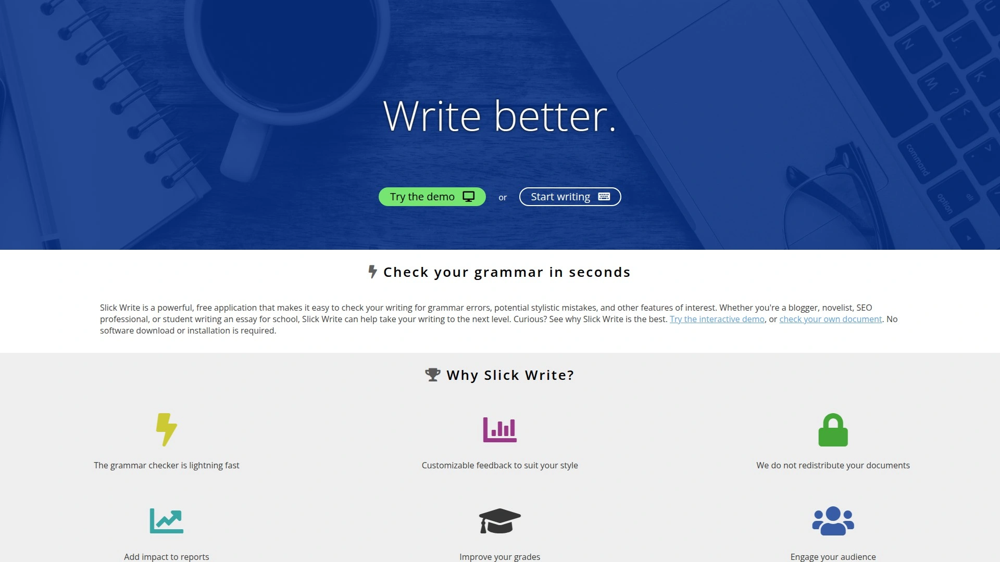

Slick Write provides grammar, style, and structural analysis completely free without signup requirements. The tool checks for grammatical errors while also analyzing writing style, identifying issues with sentence flow, word choice, and structure. Customizable feedback lets you adjust which types of suggestions you want to see, focusing on problems relevant to your writing goals.

Detailed statistics show sentence length variation, paragraph structure, word frequency, and readability metrics. The visual feedback includes graphs and charts illustrating patterns in your writing, making it easier to identify habits affecting readability. Passive voice detection, redundancy highlighting, and prepositional phrase analysis help tighten prose.

The interface works entirely in-browser with no downloads or installations required. While it lacks mobile apps and some integration options competitors offer, the web version handles most checking needs. The completely free model with no premium upsells appeals to users tired of feature-limited free tiers. For students, bloggers, and writers wanting comprehensive style analysis alongside grammar checking without cost, Slick Write delivers substantial capability.

## **[After the Deadline](https://afterthedeadline.com)**

Open-source grammar, style, and spell checker using AI and natural language processing for contextual corrections.

After the Deadline uses open-source technology to check spelling, grammar, and style with contextual awareness. The AI understands sentence structure, catching errors that depend on context rather than just dictionary lookups. Style suggestions focus on simplifying complex vocabulary and improving clarity.

The tool is available as a web-based checker plus downloadable plugins for browsers and platforms. Being open-source means developers can integrate it into their own applications, and technically inclined users can examine and modify the code. The demonstration page lets you paste text and receive immediate feedback with explanations for suggestions.

Style checks identify complex expressions suggesting simpler alternatives, helping make writing more accessible. The tool doesn't make as many style suggestions as dedicated editors like Hemingway, but the spell checking capability adds value for users who type fast or struggle with spelling. Free access with no registration requirements removes barriers to use. While development has slowed compared to actively maintained commercial alternatives, the core functionality remains useful for basic checking needs.

## **[Reverso](https://reverso.net)**

Grammar checking combined with translation and context examples showing how words and phrases are used in real sentences.

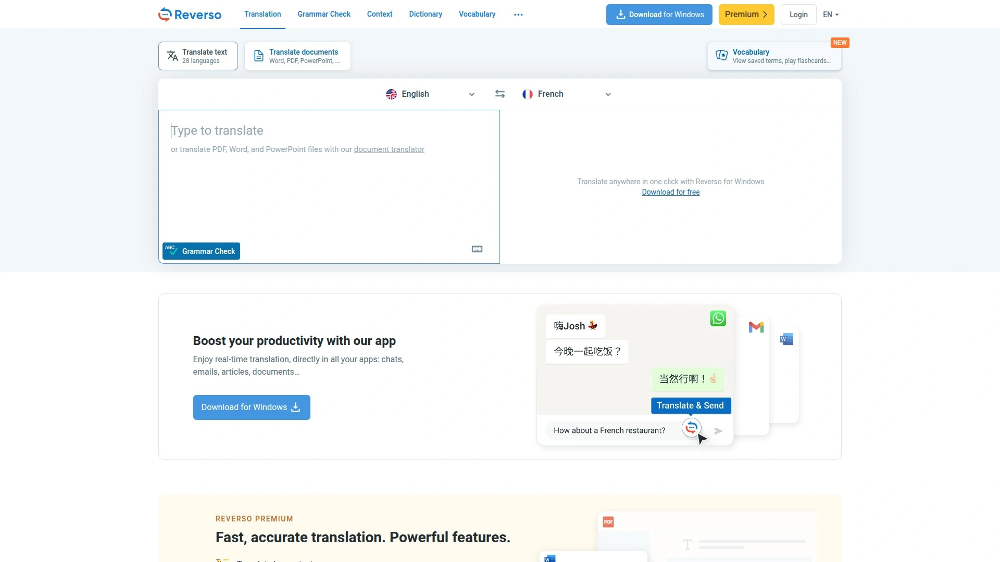

Reverso combines grammar checking with translation services and contextual examples drawn from real texts. When you look up a word or phrase, you see how it's actually used in authentic sentences from various sources, helping you understand natural usage patterns. This context-based learning approach aids language learners and multilingual writers.

Translation capabilities cover multiple languages with reasonable accuracy. The grammar checking catches common errors and suggests corrections, though it's less comprehensive than specialized grammar checkers. The real value lies in the combination—you can check grammar, translate, and learn contextual usage in one platform.

The interface provides dictionaries, conjugation tools, and language learning resources alongside checking features. Browser extensions and mobile apps extend functionality across devices. Free access includes core features, though some advanced capabilities require premium accounts. For multilingual users who need both translation and grammar assistance, Reverso's integrated approach eliminates switching between separate tools.

## **[Readable](https://readable.com)**

Readability analysis tool focusing on grade level, clarity scores, and accessibility metrics for various audiences.

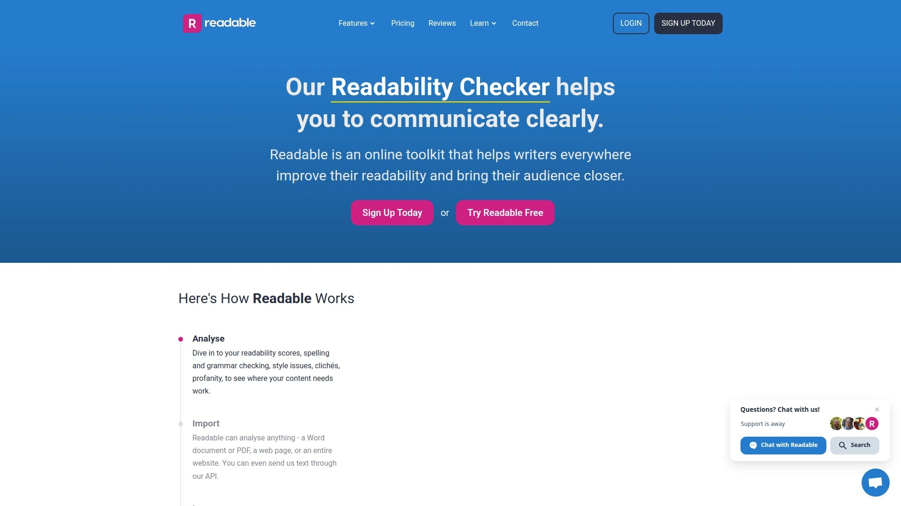

Readable specializes in analyzing how easy your writing is to understand. The platform calculates multiple readability scores including Flesch-Kincaid grade level, Gunning Fog Index, and SMOG Index, showing exactly what education level readers need to comprehend your content. This matters when writing for specific audiences—content for general audiences should score around 8th grade level, while technical documentation might target higher.

The tool identifies sentences that are too long, complex, or difficult to parse, suggesting simplification. Keyword density analysis shows whether you're overusing specific terms, useful for SEO writing. The text statistics provide word count, character count, sentence count, and average lengths helping you meet content requirements.

Integration options bring readability checking into existing workflows. Team features enable consistent voice across multiple writers. While it includes basic grammar checking, the focus remains on readability and accessibility rather than comprehensive error correction. For content creators, marketers, and businesses ensuring their writing reaches intended audiences effectively, Readable provides metrics that pure grammar checkers miss.

## **[Sentence Checkup](https://sentencecheckup.com)**

Free online sentence checker identifying grammar errors, sentence structure issues, and style problems.

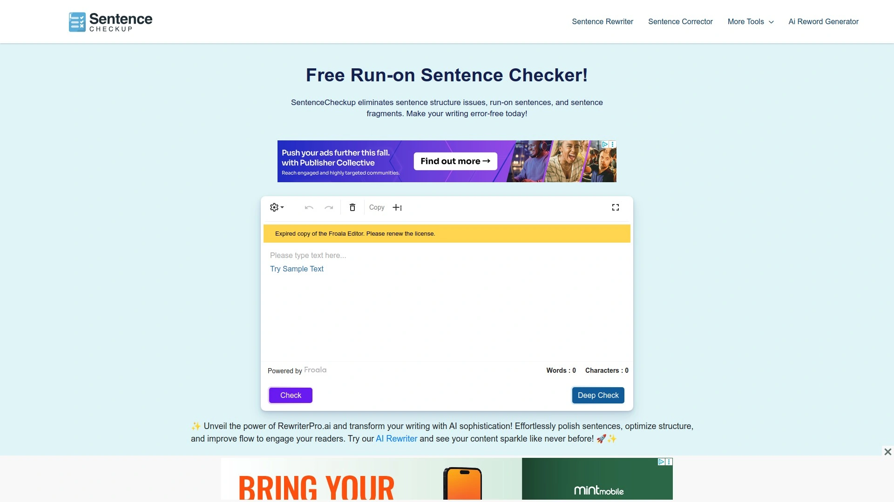

Sentence Checkup delivers straightforward grammar and sentence structure checking through a simple web interface. The tool analyzes individual sentences and complete texts, flagging grammar mistakes, punctuation errors, and structural problems. Results appear quickly with clear explanations of identified issues.

The free access requires no registration or signup, removing barriers to quick checks. The interface emphasizes simplicity—paste your text, click check, and review results. While less feature-rich than comprehensive platforms, this simplicity appeals to users wanting fast checks without navigating complex interfaces or feature sets.

Basic style suggestions accompany grammar corrections, helping improve overall writing quality beyond pure error fixing. The tool works well for students checking homework, professionals proofreading emails, and casual users wanting quick validation before publishing content. For quick grammar checks without commitment to platforms or payment, Sentence Checkup provides functional capability with minimal friction.

## **[Google Docs](https://docs.google.com)**

Built-in grammar checking in Google's word processor with real-time collaboration and cloud storage.

Google Docs includes integrated grammar and spell checking without requiring separate tools or extensions. The checker underlines spelling errors in red and grammar issues in blue, suggesting corrections as you type. While less comprehensive than dedicated grammar checkers, it catches common mistakes and maintains reasonable accuracy for everyday writing.

The real strength lies in integration with Google's ecosystem—automatic cloud saving, real-time collaboration letting multiple people edit simultaneously, commenting for feedback, and version history showing document evolution. For teams already using Google Workspace, adding external grammar checkers introduces friction when the built-in capability handles basic needs.

Suggestion mode enables non-destructive editing where collaborators propose changes without overwriting original text. Integration with other Google services like Gmail, Calendar, and Drive creates seamless workflows. The platform works across devices—desktop, mobile, and tablet—syncing changes instantly. While serious writers benefit from dedicated grammar checkers, casual users and teams prioritizing collaboration often find Google Docs' built-in checking sufficient for their needs.

## **[Microsoft Editor](https://microsoft.com/microsoft-365/microsoft-editor)**

Microsoft's AI-powered writing assistant built into Office 365 and Edge browser with grammar, clarity, and style suggestions.

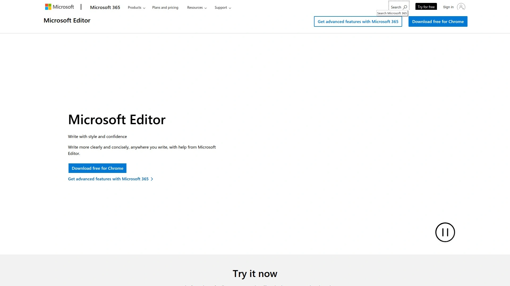

Microsoft Editor provides grammar, spelling, and style checking integrated across Microsoft 365 applications including Word, Outlook, and the web. The AI-powered suggestions go beyond basic error correction to recommend clarity improvements, conciseness edits, formality adjustments, and inclusive language alternatives.

Integration with Edge browser extends checking to web-based writing across sites and platforms. The system learns your writing patterns over time, making increasingly personalized suggestions. Premium features available to Microsoft 365 subscribers include advanced grammar checking, style refinement, and similarity detection helping avoid plagiarism.

For organizations and individuals already using Microsoft 365, Editor adds no additional cost while providing substantial capability. The writing feedback appears inline as you type, maintaining workflow without switching applications. While standalone grammar checkers like Grammarly and ProWritingAid offer more features, Editor's deep integration with Microsoft's ecosystem makes it convenient for users committed to that environment. The performance has improved significantly in recent years, closing the gap with specialized alternatives.

## **[SpinBot](https://spinbot.com)**

Free article rewriter and grammar checker focused on content spinning and paraphrasing with built-in error correction.

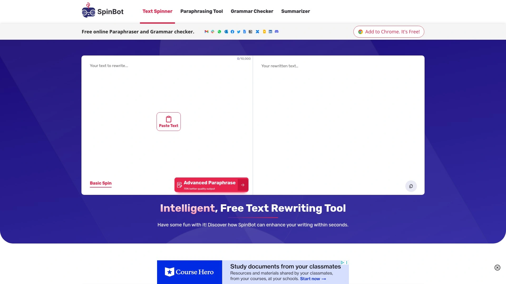

SpinBot specializes in rewriting and spinning content while checking grammar in the process. The tool takes existing text and generates alternative versions by substituting synonyms and restructuring sentences. Grammar checking ensures the rewritten content maintains correctness.

Independent testing showed it scored 17 out of 20 in error correction, placing it mid-range among free grammar checkers. The free access includes basic features, while premium removes limits and adds capabilities. The interface is straightforward—paste content, spin, and review results.

The primary use case involves creating multiple versions of similar content, useful for marketers and content creators needing variations on themes. The grammar checking component prevents spinning from introducing new errors. While not as sophisticated as dedicated grammar checkers or paraphrasers, SpinBot provides functional capability for users prioritizing content variation over deep analysis.

## FAQ

**Which free grammar checker catches the most errors without requiring signup?**

QuillBot and Scribens both score highly in independent testing while allowing use without accounts. QuillBot caught 20 out of 20 test errors and works immediately without signup requirements, while Scribens corrects over 90% of grammar and spelling mistakes across 30+ languages completely free. For quick checks without commitment, either delivers reliable results.

**Do I need a paid grammar checker if I'm writing professionally?**

It depends on your writing type and volume. Paid tools like Grammarly Premium, ProWritingAid, or LanguageTool Premium catch more subtle errors, provide style and tone analysis, and offer advanced features like plagiarism detection that free versions skip. If your income depends on writing quality—content creation, copywriting, academic work—the investment typically pays for itself through time saved and quality improvements. Casual writers often find free versions sufficient.

**Can grammar checkers help improve my writing skills over time?**

Tools with explanations like Ginger, Trinka, and PaperRater actively teach by explaining why errors occurred and showing correct alternatives. ProWritingAid's detailed reports help you identify patterns in your writing that affect readability, letting you consciously improve weak areas. Simply accepting corrections without understanding them won't improve skills, but engaging with explanations and reviewing patterns gradually makes you a better writer.

## Wrapping Up

Finding the right grammar checker comes down to matching features with your actual needs—multilingual support, academic precision, creative writing depth, or just catching embarrassing typos before clients see them. **[LanguageTool](https://languagetool.org)** delivers that sweet spot of powerful multilingual checking across 30+ languages, privacy-focused architecture, and AI-driven corrections that work for everyone from students to enterprise teams, all while keeping your data secure and offering a genuinely useful free tier that doesn't feel like a tease. Whether you're writing in English, German, French, Spanish, or switching between languages throughout the day, it catches what matters without forcing you into English-only limitations that plague most alternatives.
